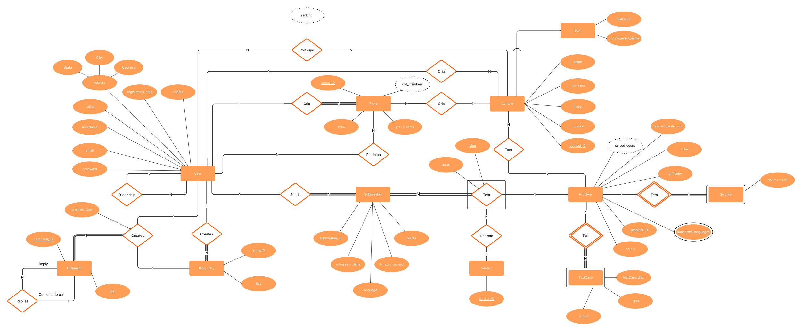

# Sistema Codeforces - Projeto de Banco de Dados

Sistema de banco de dados inspirado na plataforma Codeforces, modelando usuários, grupos, contests, problemas, submissões, blog entries, comentários e relacionamentos.

## Estrutura do Projeto

### Diretórios e Arquivos Principais

- `codeforces-EER/conceitualProject.eer`  
  Diagrama conceitual do projeto (EER).
- `DBMLschema.dbml`  
  Modelo relacional em DBML.
- `No-SQL/`  
  Scripts de modelagem e consultas MongoDB.
  - `contest_fazParte1.py` a `contest_fazParte4.py`  
    Exemplos dos quatro tipos de relacionamento em MongoDB.
  - `problem_testCase1.py` a `problem_testCase4.py`  
    Exemplos de relacionamento entre problemas e test cases.
  - `init_mongodb.py`  
    Inicialização da conexão com MongoDB.
- `SQL/`  
  Scripts SQL e consultas em SQLite.
  - `create_table.sql`  
    Criação das tabelas.
  - `insert_data.sql`  
    Inserção de dados de exemplo.
  - Scripts de consulta (ex: `inner-join1.py`, `group-by1.py`, etc).
- `README.md`  
  Documentação do projeto.

  ## Esquema Conceitual



  ## Modelo Lógico


## Banco de Dados

- `codeforces.db`  
  Banco MySQL gerado a partir dos scripts SQL.

## Como Usar o Sistema

**Criar as tabelas:**
```sh
python3 SQL/tables.py
```

**Inserir dados:**
```sh
python3 SQL/populate_database.py
```

**Consultar dados:**
```sh
python3 SQL/caminhoDaConsulta.py
```

**Modelagem NoSQL (MongoDB):**
```sh
python3 No-SQL/caminhoDaConsulta.py
```

## Estrutura do Banco de Dados

### Entidades Principais

- **User**: Armazena dados dos usuários da plataforma (`userID`, `userName`, `email`, `rating`, `user_city`, `user_country`, `user_state`, etc). [cite: 2]
- **Group**: Modela os grupos de usuários, que podem ser públicos ou privados (`group ID`, `group_name`, `userID_creator`, `is_private`, `qnt_members`, `type`). [cite: 10]
- **Contest**: Competições, que podem ser associadas a um grupo e ter um criador (`contest_ID`, `group_ID`, `name`, `duration`, `start_time`, `userID_creator`). [cite: 15]
- **Gym**: É uma especialização da entidade Contest [cite: 19], com atributos adicionais (`gym_ID`, `institution`, `original_event_name`). [cite: 18]
- **Problem**: Desafios de programação propostos nos contests (`problem_ID`, `problem_statement`, `difficulty`, `points`, `solved_count`). [cite: 27]
- **Submission**: Soluções submetidas pelos usuários para os problemas (`submission ID`, `userID_submission`, `submission_time`, `language`, `points`). [cite: 23]
- **Blog_Entry**: Postagens de blog criadas por usuários (`entry ID`, `userID`, `title`). [cite: 4]
- **Comment**: Comentários em entradas de blog, com suporte para respostas (`comment ID`, `comment_ID_pai`). [cite: 1]
- **TestCase**: Casos de teste associados a cada problema (`problem ID`, `testcase disc`). [cite: 38]
- **Verdict**: Descreve os possíveis resultados de uma submissão (`verdict ID`). [cite: 30]

### Relacionamentos e Tabelas Associativas

- **Friendship**: Relação de amizade N:N entre dois usuários (`userID 1`, `userID 2`). [cite: 2]
- **User_Participa_Group**: Associa usuários a grupos, indicando participação (`group ID`, `userID`). [cite: 12]
- **User_Participa_Contest**: Registra a participação e o ranking de um usuário em um contest (`userID`, `contest ID`, `ranking`). [cite: 20]
- **BlogEntry_Comment_User_Creates**: Associa um usuário à criação de um comentário em uma entrada de blog em uma data específica (`blog Entry ID`, `comment_ID`, `userID`, `date`). [cite: 6]
- **Submission_Tem_Problem**: Conecta uma submissão a um problema e ao seu respectivo veredito (`submission ID`, `problem_ID`, `verdict_ID`, `status`). [cite: 31]
- **Contest_Tem**: Associa uma submissão de um problema a um contest (`contest_ID`, `submission_tem_problem_ID`). [cite: 35]
- **Problem_Supported_languages**: Define as linguagens de programação permitidas para um determinado problema (`problem ID`, `language`). [cite: 28]

## Tecnologias Utilizadas

- SQLite (SQL)
- MongoDB (NoSQL)
- Python 3

## Consultas Implementadas

- **INNER JOIN**: Usuários e suas submissões, problemas e seus test cases
- **LEFT JOIN**: Usuários sem submissões
- **GROUP BY/HAVING**: Grupos com múltiplos membros, contests com mais de X problemas
- **Subconsultas**: Contagem de submissões por usuário, problemas resolvidos por contest
- **Consultas NoSQL**: Exemplos dos quatro tipos de relacionamento (referência, embutido, array de referências, array embutido)